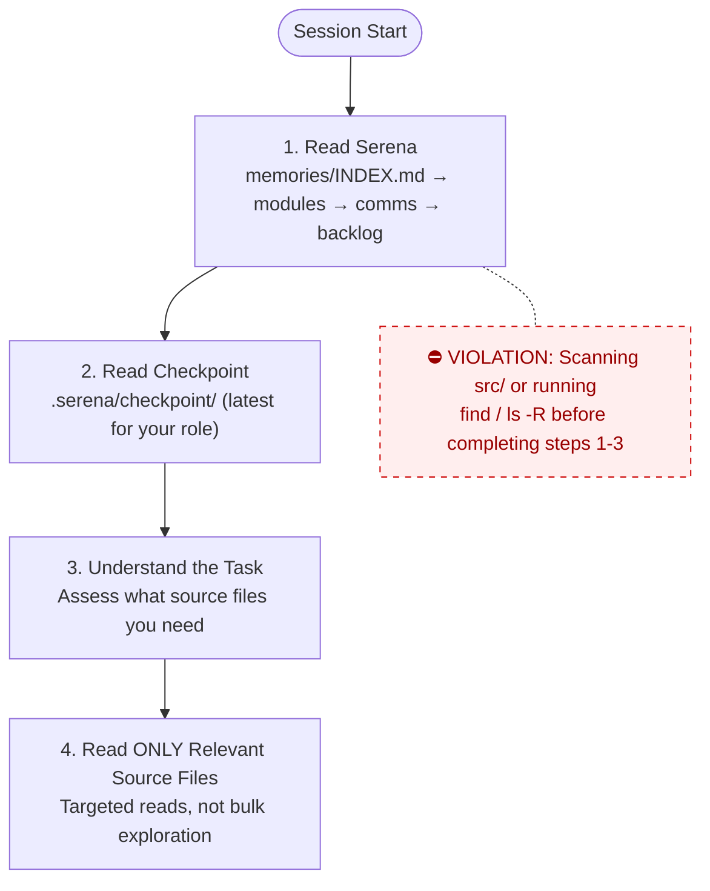
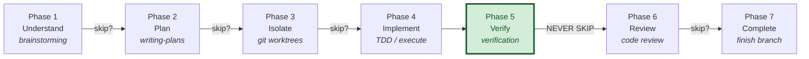
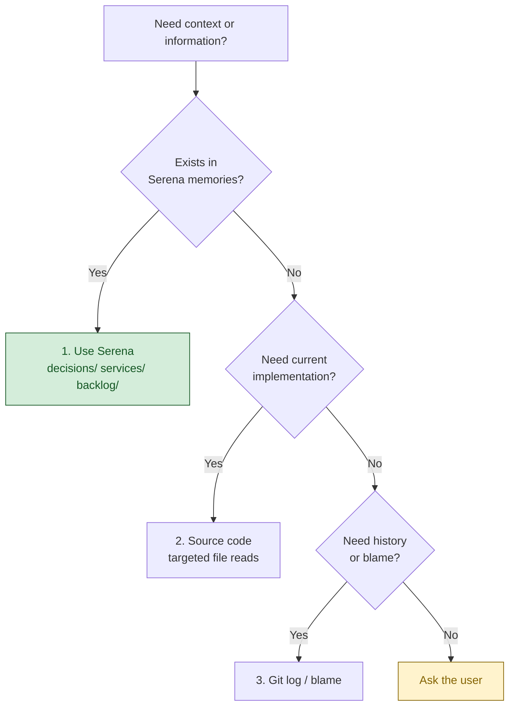
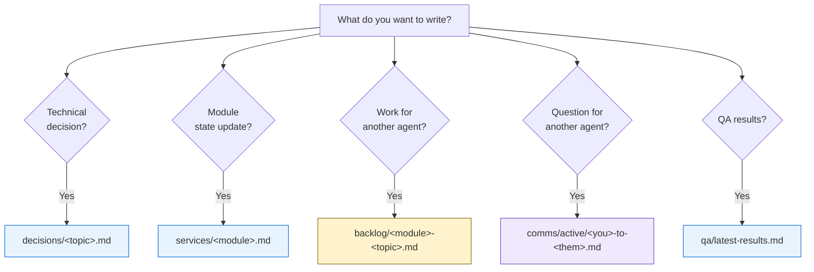

@AGENTS.md

<!-- ennam-agents-scaffold:begin v1.12.0 -->
## Agents Workflow

@AGENTS.md

### Session Boot Protocol

**Every agent MUST follow this exact sequence at session start.**
DO NOT read source code, explore directories, or scan the codebase
until you have completed steps 1-3. Source code is a last resort,
not a starting point.

1. **Read Serena** — `memories/INDEX.md` → relevant module memories → `comms/active/` → `backlog/`
2. **Read checkpoint** — `.serena/checkpoint/` for the most recent checkpoint from your role
3. **Understand the task** — you now have project context. Only NOW assess what source files you need.
4. **Read ONLY the source files relevant to your task** — targeted reads, not bulk exploration.



**Violations**: Scanning `src/`, or running `find` / `ls -R` at session start before completing steps 1-3 is a protocol violation. It wastes tokens and ignores existing knowledge.

### Org Context

Read **`ORG.md`** (repo root) at session start — the org-wide base layer shared by every role: company facts, product list, glossary, stakeholders, comms channels, and the data/tool policy baseline. It is role-agnostic and seeded once (user-owned; the scaffold never overwrites it).

- Use the glossary's canonical terms; do not invent synonyms for a defined concept.
- Respect the data/tool policy as the baseline — role profiles and the governance pack layer stricter rules on top.
- A field left as `?` is unknown: surface it, never guess (Rule 12/13).
- If **`POLICY.md`** exists (repo root), treat it as **mandatory** governance — PII handling, approval gates before irreversible/outward-facing actions, retention, and audit. Where it and a role rule conflict, the **stricter** rule wins.

### Superpowers Workflow

Every agent session follows this structured workflow.
Phases may be skipped for trivial tasks (< 3 steps, single file, obvious fix).
When skipping, state which phases you're skipping and why.

#### Phase 1 — Understand
**Skill**: `superpowers:brainstorming`
**When**: Creating features, modifying behavior, adding functionality.
**Skip if**: Bug fix with clear reproduction, typo, config change.
**Output**: Approved design in `docs/superpowers/specs/`

#### Phase 2 — Plan
**Skill**: `superpowers:writing-plans`
**When**: Task requires 3+ steps or touches multiple files/services.
**Skip if**: Single-file change with obvious implementation.
**Output**: Implementation plan with success criteria per step.

#### Phase 3 — Isolate
**Skill**: `superpowers:using-git-worktrees`
**When**: Feature work that should not pollute the working branch.
**Skip if**: Hotfix, docs-only change, or user requests in-place work.
**Output**: Isolated worktree or branch ready for implementation.

#### Phase 4 — Implement
**Skills** (use as needed):
- `superpowers:test-driven-development` — write tests first, then implementation
- `superpowers:executing-plans` — execute the plan from Phase 2
- `superpowers:dispatching-parallel-agents` — 2+ independent tasks
- `superpowers:subagent-driven-development` — delegate to specialized agents
- `superpowers:systematic-debugging` — when encountering failures during implementation
**Output**: Working code with tests.

#### Phase 5 — Verify
**Skill**: `superpowers:verification-before-completion`
**When**: ALWAYS. This phase is never skipped.
**Output**: Evidence that success criteria are met (test output, build output).

#### Phase 6 — Review
**Skill**: `superpowers:requesting-code-review`
**When**: Feature work, significant changes, anything touching shared code.
**Skip if**: Docs-only, config-only, or user explicitly waives review.
**Output**: Review feedback addressed.

#### Phase 7 — Complete
**Skill**: `superpowers:finishing-a-development-branch`
**When**: Implementation verified and reviewed.
**Output**: PR created, branch merged, or completion option presented to user.

#### Workflow Diagram



#### On-Demand Skills (any phase)
- `superpowers:systematic-debugging` — when hitting unexpected failures
- `superpowers:receiving-code-review` — when receiving feedback from others
- `superpowers:writing-skills` — when creating/modifying workflow skills

### Task Complexity Guide

| Complexity | Example | Required Phases |
|-----------|---------|-----------------|
| **Trivial** | Fix typo, update config value | Implement → Verify |
| **Simple** | Single-file bug fix, add field | Plan → Implement → Verify |
| **Medium** | New endpoint, new component | Plan → Implement → Verify → Review |
| **Complex** | New feature across services | ALL phases |

### Knowledge Source Priority

Agents MUST consult existing knowledge before exploring source code.

#### Retrieval order (strict)



1. **Serena memories** — primary source for decisions, architecture context, conventions, and inter-agent communication
2. **Source code / git log** — when you need exact current implementation details

#### When to read from Serena

| Moment | Action |
|--------|--------|
| Session start | Read `memories/INDEX.md` — understand what's been decided, what's in progress |
| Before coding a function | Check `services/<module>.md` — check related decisions and conventions |
| Before making a design decision | Search `decisions/` — check for prior decisions on same topic |
| When encountering unfamiliar code | Check memories — there may be a decision or discovery explaining it |

#### When to write to Serena

| Moment | Action |
|--------|--------|
| After making a design decision | Write to `memories/decisions/<topic>.md` |
| After discovering something non-obvious | Write to `memories/decisions/<topic>.md` |
| After completing a task | Update checkpoint + relevant service memory |
| When identifying work for another agent | Write to `memories/backlog/<service>-<topic>.md` |

### Serena MCP Protocol (canonical — defines *how*; overrides file-path wording below)

**All `.serena/memories/` I/O goes through Serena MCP tools (`mcp__serena__*`). NEVER hand-edit memory files** with Read/Edit/Write — Serena indexes memories and resolves `` `mem:` `` links; hand-editing bypasses both.

**Session start (before reading source):**
1. `mcp__serena__activate_project` for this repo **by path** → `mcp__serena__initial_instructions` (loads the manual + lists available memories).
2. `mcp__serena__read_memory`: `INDEX` → relevant `decisions/` / `services/` → `comms/active/` → `backlog/` → latest `checkpoint/`.

**Writing:** `mcp__serena__write_memory(name, content)` — names use `/` topics (`decisions/…`, `services/…`, `backlog/…`, `comms/active/…`, `qa/…`, `checkpoint/…`); link memories as `` `mem:<name>` ``. Use `mcp__serena__edit_memory` for targeted edits and `mcp__serena__delete_memory` when an item is done.

**Checkpoint (end of EVERY session):** `mcp__serena__write_memory("checkpoint/<agent-name>-<YYYY-MM-DD>", …)` → stored at `.serena/memories/checkpoint/<agent-name>-<YYYY-MM-DD>.md`.

> The subsections below (Session Boot / Knowledge Source / Serena Memory Protocol / checkpoint) remain the reference for *what* to read/write and *where things go*; **this block is authoritative for *how*** — always via Serena MCP, checkpoints under `memories/checkpoint/`.

### Mandatory Session Checkpoint

**All AI agents MUST write a checkpoint at the end of every session — via Serena MCP** (`mcp__serena__write_memory`).

**Format**: `mcp__serena__write_memory("checkpoint/<agent-name>-<YYYY-MM-DD>", …)` → stored at `.serena/memories/checkpoint/<agent-name>-<YYYY-MM-DD>.md`. Write through Serena MCP, **never** by hand-editing the file.

**Required content**:

```markdown
# Checkpoint: <agent-name> — <date>

## What was done
- <bullet list of completed work>

## Files changed
- <list of files created/modified/deleted>

## Current state
- <what is working, what is broken, what is partially done>

## Next steps
- <what the next session should pick up>

## Blockers / Risks
- <anything that could block progress>
```

**Rules**:
- Write checkpoint BEFORE ending the session — no exceptions
- If the session was interrupted or failed, still write a checkpoint noting the failure
- One file per agent per day; append if multiple sessions in the same day
- Keep each checkpoint concise (under 50 lines)
- This applies to ALL agents: any subagents, specialized agents, or the main session agent

### Serena Memory Protocol

Serena is the project's knowledge store for decisions, conventions, service state, and inter-agent communication.
All agents MUST follow these rules when reading/writing to `.serena/memories/`.

#### Read Protocol — Session Start


1. Read `memories/INDEX.md` first
2. Read `services/<your-module>.md` for current state
3. Check `comms/active/` for messages addressed to you
4. Check `backlog/` for pending action items in your domain

#### Write Protocol — What goes where



| You want to... | Write to | Naming |
|----------------|----------|--------|
| Record a technical decision | `decisions/<topic>.md` | Descriptive topic name |
| Update module/service state | `services/<module>.md` | Append or replace section |
| Flag work for another agent | `backlog/<module>-<topic>.md` | Prefix with target module |
| Ask another agent a question | `comms/active/<you>-to-<them>-<topic>.md` | |
| Respond to a question | Append to the existing file in `comms/active/` | |
| Close a resolved thread | Move both files to `comms/resolved/` | |
| Report QA results | `qa/latest-results.md` (replace) | Keep only latest |
| Store something historical | `archive/<category>/` | |

#### Rules

- **Never create new top-level directories** under `memories/`
- **Never put files directly in `memories/`** — always in a subdirectory
- **1 file per module** in `services/` — update, don't create siblings
- **Backlog items**: delete the file when the work is done
- **Comms**: respond within the SAME file (append), don't create
  a separate response file. Move to `resolved/` when done.
- **Decisions**: only for choices that affect future work. Don't store
  implementation details — those belong in code comments.
- **Update INDEX.md** when adding new files to `decisions/` or `services/`
- **QA**: `latest-results.md` is overwritten each run. Archive old
  results to `archive/qa-runs/<date>.md` before overwriting.

### Profile: next

## Stack: Next.js 16 + React 19 + TypeScript

| Layer | Tech |
|---|---|
| Framework | Next.js 16 (App Router) |
| UI runtime | React 19 (Server Components by default) |
| Language | TypeScript strict mode |
| Data fetching | TanStack Query for client-side; Server Components for server-side |
| UI primitives | shadcn/ui + Tailwind CSS 4 |
| Session | iron-session (cookie-based) |
| Linter | ESLint (next/core-web-vitals) |
| Build | `npm run build` (Turbopack) |

### Conventions

- **Default to Server Components.** Add `'use client'` only when the component uses state, effects, or browser APIs.
- **Tailwind 4 syntax.** Avoid `@apply` where utility classes work; lean on theme tokens.
- **Don't reinvent shadcn primitives.** Compose them; if you need a new one, copy from the shadcn registry rather than write from scratch.
- **Type-check before declaring done:** `npm run build` (catches type errors that `tsc --noEmit` may miss in App Router).

### Browser debugging

For runtime / browser debugging, install the [Claude for Chrome](https://www.anthropic.com/news/claude-for-chrome) extension. Open the page you're testing and ask Claude in the browser to drive it — inspection, console capture, and network tracing happen inside the browser.

### Common commands

```bash
npm run dev          # local dev server (port 3000)
npm run build        # production build + type-check
npm run start        # serve the production build
npm run lint         # eslint
```

<!-- BEGIN:nextjs-agent-rules -->
# This is NOT the Next.js you know

This version has breaking changes — APIs, conventions, and file structure may all differ from your training data. Read the relevant guide in `node_modules/next/dist/docs/` before writing any code. Heed deprecation notices.
<!-- END:nextjs-agent-rules -->

<!-- ennam-agents-scaffold:end -->
